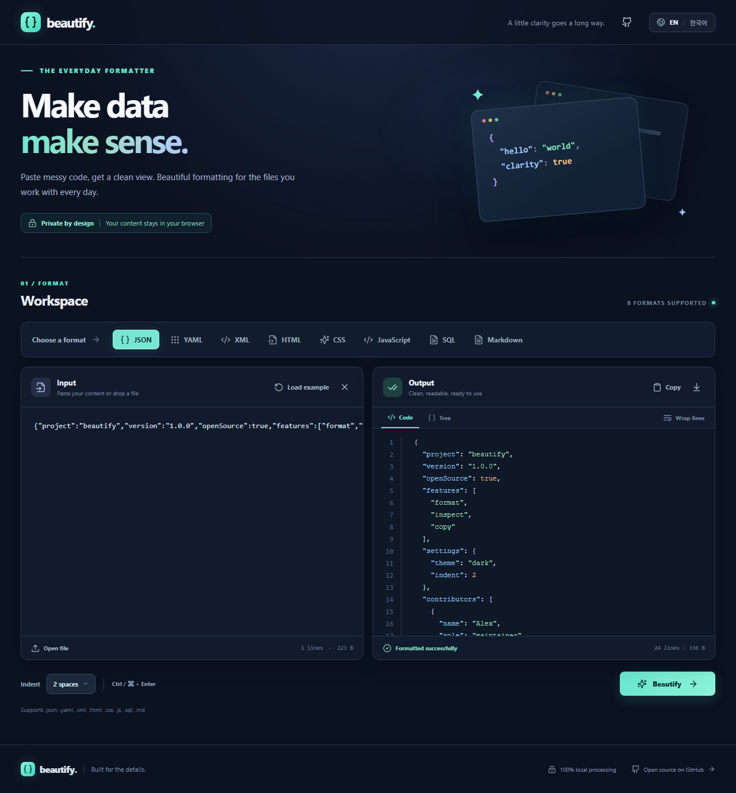
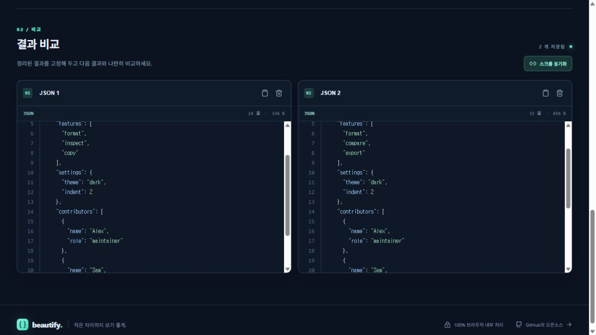

# Beautify

**Make data make sense.** Beautify is a free, open-source formatter for the files developers work with every day. Paste text or open a local file, format it, inspect the result, then copy or download it.

**Try it online:** [jwjp.github.io/beautify](https://jwjp.github.io/beautify/)

English is the default interface language. Switch to 한국어 from the header. [한국어 안내](README.ko.md)



## Features

- Format JSON, YAML, XML, HTML, CSS, JavaScript, SQL, and Markdown.
- Explore JSON with a collapsible tree view.
- Pin multiple formatted results in a side-by-side comparison area; rename, copy, remove, and scroll them together.
- Choose 2 or 4 spaces of indentation, wrap long lines, and see syntax-highlighted output.
- Open files by picker or drag and drop; copy or download the result.
- Use **Ctrl/⌘ + Enter** to format quickly.
- Process content locally in the browser. There is no server endpoint for your input.



## Run locally

Requires Node.js 20.19+ or 22.12+.

```bash
npm install
npm run dev
```

Open the address printed by Vite. To create a production build:

```bash
npm run build
npm run preview
```

Run the format tests with `npm test`.

## Supported formats

| Format | Engine |
| --- | --- |
| JSON | Native JSON parser/stringifier |
| YAML, HTML, CSS, JavaScript, Markdown | [Prettier](https://prettier.io/) |
| XML | [fast-xml-parser](https://github.com/NaturalIntelligence/fast-xml-parser) validation and [xml-formatter](https://github.com/chrisbottin/xml-formatter) |
| SQL | [SQL Formatter](https://github.com/sql-formatter-org/sql-formatter) |

The SQL option uses the library's general SQL dialect. SQL formatting does not verify that a query will run against your database. The XML formatter may change whitespace in mixed-content documents; review those documents before using the output.

## Privacy

Formatting runs in your browser. Files you open and text you paste are not uploaded by this app. Only the interface language is saved in local storage; input and output are not persisted. Dependencies are bundled during the build, so the app does not need third-party formatting services at runtime.

## Contributing

Issues and pull requests are welcome. See [CONTRIBUTING.md](CONTRIBUTING.md). The project is released under the [MIT license](LICENSE).
